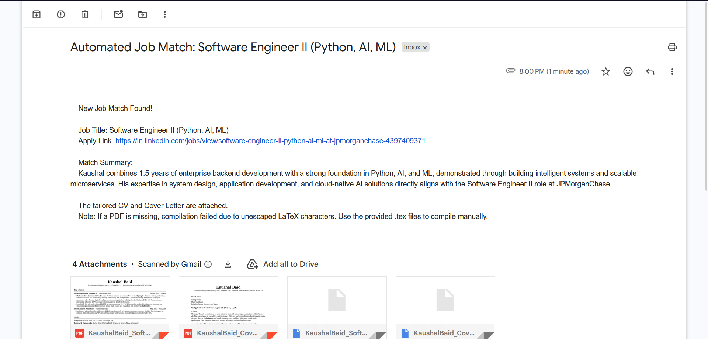

# AI LaTeX Resume Generator & Job Search Automation Pipeline

[](https://www.python.org/)
[](https://deepmind.google/technologies/gemini/)
[](https://tectonic-typesetting.github.io/)
[](https://github.com/features/actions)


A fully automated, headless Python pipeline that scrapes job boards, evaluates candidate fit using Gemini 2.5 Flash, and dynamically compiles tailored LaTeX resumes and cover letters.

Stop manually tweaking your resume for every application. Let this automated pipeline act as your personal technical recruiter.

## ✨ How it Works
1. **Scraping:** Fetches high-quality, recent job postings via the [Fantastic.jobs LinkedIn API](https://rapidapi.com/fantastic-jobs-fantastic-jobs-default/api/linkedin-job-search-api).
2. **Pre-Filtering:** Instantly filters out noise using hardcoded logic. Automatically drops roles requiring more experience than your current level, roles missing core tech stack requirements (Java/Python/C++), and specific excluded companies (e.g., mass-hirers, consultancies).
3. **AI Evaluation:** Feeds the surviving Job Descriptions and base LaTeX templates to Google's Gemini LLM to determine if the role is a genuine, high-probability match.
4. **Dynamic Tailoring:** If approved, Gemini rewrites specific bullet points within the LaTeX document to perfectly align with the JD keywords without hallucinating skills or breaking the one-page constraint.
5. **Compilation:** Compiles the tailored `.tex` files into ATS-compliant PDFs headlessly using the Tectonic engine.
6. **Delivery:** Emails a summarized match report, the attached PDFs, and raw `.tex` source files directly to the user.

## 📊 Sample Output



## 🛠️ Tech Stack
* **Python 3.11:** Core pipeline logic and scripting.
* **Google Gemini API (`google-genai`):** LLM evaluation, decision-making, and NLP document tailoring.
* **RapidAPI:** Robust job data retrieval.
* **Tectonic:** Lightning-fast, local LaTeX-to-PDF compilation without the bloat of a full TeX Live installation.
* **GitHub Actions:** Cron-scheduled, serverless execution.

---

## ⚙️ Configuration & Setup

Because this pipeline processes personal information, **do not hardcode or commit your templates to the repository.**

### Option 1: Cloud Deployment (GitHub Actions)
To deploy your own autonomous instance, fork this repository and add the following to your repository's **Settings > Secrets and Variables > Actions**:

| Secret Name | Description |
| :--- | :--- |
| `RAPIDAPI_KEY` | API key for Fantastic.jobs LinkedIn API |
| `GEMINI_API_KEY` | Your Google Gemini API key |
| `GMAIL_USER` | The email address sending/receiving the reports |
| `GMAIL_APP_PASSWORD` | 16-character App Password for the Gmail account |
| `BASE_CV_TEX` | The raw text of your base LaTeX resume |
| `BASE_CL_TEX` | The raw text of your base LaTeX cover letter |

### Option 2: Local Development
If you want to run or test the script locally on your machine, the script is designed to safely read your local `.tex` files without needing to embed them in environment variables.

1. Clone the repository.
2. Install the required dependencies:
   ```bash
   pip install -r requirements.txt
   ```
3. Copy the example environment file:
   ```bash
   cp .env.example .env
   ```
4. Open `.env` and replace the placeholder strings with your actual API keys and email credentials.
5. Place your base resume and cover letter in the root of the project folder and name them exactly **`cv.tex`** and **`cl.tex`**. 
6. Run the pipeline:
   ```bash
   python main.py
   ```

*(Note: The `.env`, `cv.tex`, and `cl.tex` files are listed in `.gitignore` by default to ensure your keys and personal data are never accidentally pushed to GitHub).*

## 🔒 Security & Privacy

Privacy is a first-class citizen in this project. All resumes, cover letter templates, personal information, and API keys are stored strictly as GitHub Secrets and injected directly into memory at execution time.

**No personal data is stored, saved, or exposed in the public codebase.**